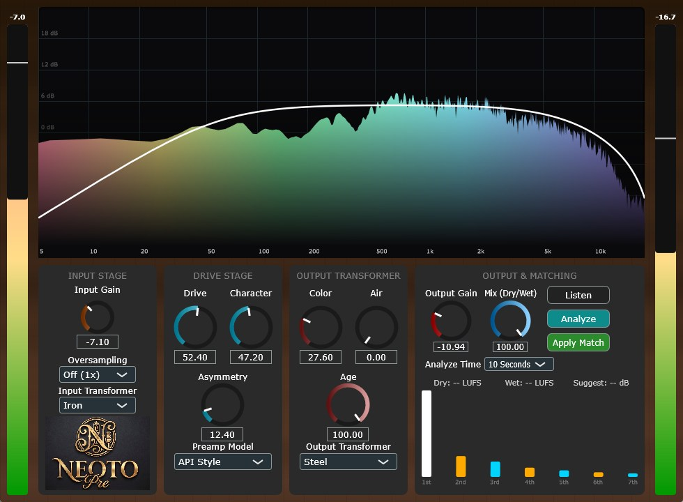

# NEOTO_Pre

##

## Overview
**NEOTO_Pre** is an open-source, highly detailed analog-modeled preamplifier and transformer saturation VST3 plugin. Engineered with rigorous digital signal processing (DSP) principles, it provides authentic vintage warmth, harmonic richness, and dynamic spatial depth to your digital audio workstation.

Rather than relying on static waveshapers, NEOTO_Pre utilizes physical modeling of magnetic hysteresis and discrete component behavior, combined with state-of-the-art Anti-Aliasing techniques, to deliver zero-compromise audio quality.

## Key Features

### 🎛️ Analog-Modeled Preamplifiers
Selectable amplification stages, each modeled after legendary analog consoles and outboard gear:
*   **API Style:** Punchy, mid-forward character with symmetrical clipping (3rd-order harmonics).
*   **Neve Style:** Class-A single-ended behavior providing thick, asymmetrical saturation (2nd-order harmonics).
*   **Vintage Tube:** Warm, smooth compression mimicking EF804S/E83F pentode tube island-effects.
*   **SSL Modern:** High-slew-rate, ultra-clean amplification with precise clipping boundaries.
*   **Modern 1 & 2:** Contemporary, high-fidelity topologies for subtle coloration.

### 🧲 Transformer Emulations (Input & Output)
Independent selection of Input and Output transformers, utilizing **Jiles-Atherton** and **Tellinen** magnetic hysteresis models to accurately reproduce low-end bloom, transient smearing, and phase dispersion:
*   **Nickel (Mu-metal):** Ultra-high permeability, transparent transients, and aggressive hard-clipping when pushed.
*   **Steel (M6 Silicon):** Classic low-end bloom and "analog glue."
*   **Iron:** Wide hysteresis loop for aggressive, dense low-mid punch.
*   **Amorphous:** Massive headroom with supreme high-frequency resolution.
*   **Carnhill (TG2 Style):** Iconic British console warmth.
*   **Cinemag (B173 Style):** American-style punch with excellent phase response.

### 🎚️ Precision Tone Shaping
*   **Drive & Character:** Independent control over saturation depth and Even/Odd harmonic balance.
*   **Color & Air:** Transformer-specific, real-time recalculating Biquad shelf filters for low-end thickness and 5kHz~10kHz high-frequency sheen.
*   **Age:** Dynamic high-pass and low-pass filtering to emulate component degradation and bandwidth limiting.

### 🔬 Advanced DSP Engine
*   **ADAA (Antiderivative Anti-Aliasing):** 1st and 2nd order ADAA algorithms applied to non-linear stages to eliminate foldover distortion mathematically.
*   **Oversampling:** Up to 8x linear-phase oversampling for extreme drive scenarios.
*   **Thread-Safe Architecture:** 100% heap-allocation-free DSP processing loop. Biquad coefficients and state variables are calculated inline, ensuring absolute stability and zero CPU spikes during automation or rapid parameter changes.

### 📊 Visual & Utility Tools
*   **Real-time Analyzer:** High-resolution FFT spectrum display with an integrated Harmonic Level Visualizer.
*   **Gain Matching:** Intelligent `Analyze` and `Apply Match` functions to compensate for perceived loudness changes introduced by heavy saturation.

## System Requirements
*   **OS:** Windows 10 / Windows 11 (64-bit)
*   **Format:** VST3
*   **Tested Host:** Ableton Live 11

*(Note: This plugin is developed and compiled exclusively for Windows architectures.)*

## Installation
1. Download the latest `NEOTO_Pre.vst3` file from the [Releases](#) page.
2. Move the `.vst3` file to your default VST3 plugin directory:
   `C:\Program Files\Common Files\VST3`
3. Rescan your plugins in Ableton Live 11.

## Disclaimer & Stability
This software is provided "as-is", without any warranty of any kind. 
The DSP core has been strictly engineered to prevent `NaN` generation, zero-division, and memory leaks. The architecture isolates the audio thread from UI operations to maintain host stability under heavy loads.

## License
This project is completely free and open-source. It is distributed under the **GPLv3 License** (due to JUCE framework standard open-source licensing). You are free to study, modify, and distribute the source code under the same terms.

## 🎓 Credits

**Developer**: @kijyoumusic (OTODESK)  
**Music Production Background**: Electronic Music, Sound Design  
**Target DAW**: Ableton Live 11+  
**Framework**: JUCE 8.0.8  
**Platform Support**: Windows 10+

---

## 📞 Support

- **Social**: [@kijyoumusic](https://twitter.com/kijyoumusic)
